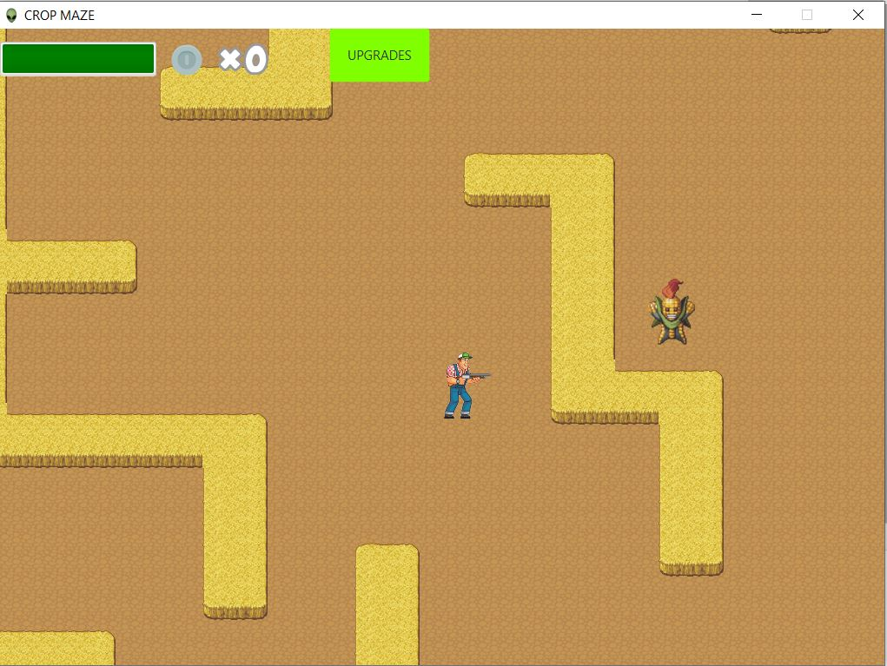

## Importing CropMaze into Eclipse
To import the project into Eclipse, use as import tool "Gradle->Existing Gradle Project".

## Creating and executing JAR

* Create JAR file using the command: ./gradle fatJar
 
* The JAR file will be exported in build/libs/CropMaze-all-0.0.1.jar

* Execute the JAR file with the command: java -jar CropMaze-all-0.0.1.jar

## Enjoy CropMaze!

Main menu

Game

Upgrades

game over

